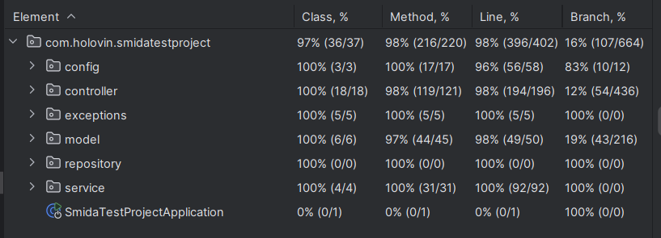

# Smida Test Project

## Table of Contents
- [Introduction](#introduction)
- [Technologies](#technologies)
- [Getting Started](#getting-started)
- [Architecture](#architecture)
- [Test Coverage](#test-coverage)

## Introduction
The project consists in the development of a RESTful service for the management of company data and their reporting for the Agency for the Development of the Infrastructure of the Stock Market of Ukraine (SMIDA). The project includes CRUD operations for companies and their reports, authentication and authorization, database migrations, unit and integration tests, docker compose for deployment, startup instructions.  This project includes features like JWT-based authentication, user and company management, and API documentation using Swagger.

## Technologies
- **Java 17**
- **Spring Boot**
- **Spring Security**
- **JWT(JSON Web Tokens)**
- **PostgreSQL** 
- **MongoDB**
- **Hibernate**
- **Liquibase**
- **Swagger**
- **JUnit**
- **Maven**
- **Docker**

## Architecture
The application follows Model-View-Controller architecture with clear separation of concerns. Key components include:
- **Controllers**: Handle HTTP requests and responses.
- **Services**: Contain business logic.
- **Repositories**: Interact with the database.
- **Security**: Configure authentication and authorization.

## Getting Started

### Clone the Repository
```bash
git clone https://github.com/bohdan-holovin/smida-test-project.git
cd smida-test-project
```

### Build the Project
To build the project, run the following command:
```bash
mvn clean install
```

### Run the Application
You can run the application locally using Maven or Docker Compose.

#### Using Maven
```bash
mvn spring-boot:run
```

#### Using Docker Compose
Ensure Docker is installed and running on your machine. Then, run the following command:
```bash
docker-compose up
```

This command will start the application and all required services defined in the `docker-compose.yml` file.

#### API documentation
   Open your browser and navigate to `http://localhost:8080/swagger-ui.html`.

#### Using JWT Authentication
1. **Register a new user:**
    ```bash
    curl -X POST "http://localhost:8080/users" -H "Content-Type: application/json" -d '{"username":"testuser", "password":"password"}'
    ```
2. **Authenticate the user to receive a JWT token:**
    ```bash
    curl -X POST "http://localhost:8080/authenticate" -H "Content-Type: application/json" -d '{"username":"testuser", "password":"password"}'
    ```
   You will receive a JWT token in the response.

3. **Access secured endpoints using the JWT token:**
    ```bash
    curl -X GET "http://localhost:8080/companies" -H "Authorization: Bearer your_jwt_token"
    ```

By following these detailed instructions, you should be able to set up, run, and interact with the Smida Test Project successfully.

## Test Coverage
The `smida-test-project` has been rigorously tested to ensure high code quality and reliability. The test coverage statistics are as follows:

- **Overall Coverage**:
   - **Classes**: 97%
   - **Methods**: 98%
   - **Lines**: 98%



